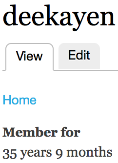

Member for hack
===============

Alter the creation date on a user profile that is used for displaying the "Member for" time period.

Suggested altered creation dates:

* Date of hire (employment)
* Birthday (blog)

This module isn't sensitive to specific times of day. It just implements the date, so it'll set the creation days when user profiles are saved to midnight, offset for timezone.

Current Maintainer
------------------

- David Norman (https://github.com/deekayen)

Credits
-------

- Originally written for Drupal by David Norman (https://www.drupal.org/sandbox/deekayen/2311165)
- Ported to Backdrop by David Norman (https://github.com/deekayen)

License
-------

This project is GPL v2 software. See the LICENSE.txt file in this directory for
complete text.
